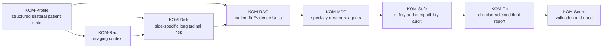

[README.md](https://github.com/user-attachments/files/28964414/README.md)
# KOM: Knee Osteoarthritis Manager

[Public demo](https://kom-workbench-public-demo.onrender.com/dashboard)

KOM is a research-oriented clinical decision-support workbench for knee osteoarthritis management. It brings together structured patient assessment, bilateral knee imaging context, longitudinal risk estimation, evidence retrieval, multidisciplinary treatment planning, safety review, and clinician-selectable reporting in one inspectable workflow.

The project is designed for sports medicine, orthopaedics, rehabilitation, chronic disease management, and clinical AI research. It is not a patient self-diagnosis tool, not an autonomous prescribing system, and not a replacement for licensed clinician judgment.

## Why KOM Exists

Knee osteoarthritis care is not a single model prediction or a one-line recommendation. A useful management plan must consider pain, function, imaging findings, body weight, metabolic risk, prior treatment, medication safety, exercise tolerance, patient goals, surgical boundaries, and the quality of supporting evidence.

KOM turns this complex decision process into a transparent clinical workflow:

- profile the patient and both knees separately;
- keep imaging, symptoms, risk, evidence, and treatment reasoning connected;
- retrieve traceable guideline, review, trial, and contextual evidence;
- let specialty agents draft domain-specific treatment options;
- run safety and compatibility checks before a plan is accepted;
- keep the clinician in control of the final prescription;
- export a report and validation trace that reviewers can inspect.

In short, KOM is built to make knee osteoarthritis decision-support more structured, more auditable, and easier to explain.

## What You Can See in the Demo

The public demo opens a complete KOM clinical workbench. A reviewer can move through the whole pathway without needing access to private clinical data.

| Area | What it shows |
|---|---|
| Dashboard | A visual overview of the KOM-Assess and KOM-Treat workflow. |
| KOM-Profile | Four selectable patient examples, bilateral KL grades, pain NRS, WOMAC function, BMI, safety gates, outcome calculators, and profile persistence. |
| KOM-Rad | Structured knee imaging interpretation with side-specific radiographic context. |
| KOM-Risk | Backend endpoint-backed bilateral risk prediction for structural progression, surgery-event risk, and symptom/function worsening. |
| KOM-RAG | Patient-fit evidence retrieval, Evidence Unit details, evidence graph, catalog search, pagination, and export. |
| KOM-MDT | Specialty treatment agents for rehabilitation, weight/nutrition, medication/injection, psychology/self-management, and orthopaedic referral boundaries. |
| KOM-Safe | Safety-gate auditing and Safe-MDT negotiation with event-level revision traces. |
| KOM-Rx | Clinician-selectable prescription builder, evidence-supported final plan, Markdown/HTML report export, and final prescription persistence. |
| KOM-Score | Validation center for route availability, wording, controls, evidence display, safety negotiation, and report export. |
| Settings | Optional OpenAI-compatible model configuration. The deterministic local pathway remains available without a model API key. |

## System Architecture



KOM is intentionally modular. Each layer has a clear responsibility, so evidence retrieval does not silently become a prescription, imaging severity does not automatically become surgery, and a treatment draft does not become final until safety gates and clinician review boundaries are recorded.

## Core Modules

### KOM-Profile

KOM-Profile converts a case into a structured clinical state. It separates the left and right knees, records KL grade, pain NRS, WOMAC function, BMI, progression status, treatment history, comorbidity and medication safety information, and missing data. Downstream modules read this state instead of inventing new case facts.

### KOM-Rad

KOM-Rad displays imaging-aware information for each knee. It anchors the workflow in radiographic severity and structural findings while keeping imaging interpretation as supporting context rather than an automatic treatment decision.

### KOM-Risk

KOM-Risk estimates three major longitudinal outcome domains:

- structural progression;
- fixed-window knee surgery event risk;
- symptom and function worsening.

The current workbench includes side-specific and bilateral-coupled risk logic. KL grade is locked from KOM-Profile, while scenario variables such as BMI, pain, and WOMAC function can be explored through the risk endpoint.

### KOM-KB and KOM-RAG

KOM-KB organizes literature and guideline content as structured Evidence Units. Each unit records source identity, evidence level, treatment domain, population, intervention, comparator/context, outcomes, safety notes, prescription use, and traceability fields.

KOM-RAG retrieves evidence by combining patient context, treatment domain, guideline anchors, evidence level, safety tags, and graph relations. The current local catalog contains thousands of Evidence Units and supports interactive search, graph display, patient-fit retrieval, and JSON export.

### KOM-MDT

KOM-MDT routes the patient profile and evidence pack to specialty agents. The current treatment board covers rehabilitation, nutrition/weight, pharmacologic and injection options, psychology/self-management, orthopaedic boundaries, and final synthesis.

Each agent is expected to state the patient fit, evidence basis, prescription content, non-selection reasoning, safety limits, and clinician-review boundary.

### KOM-Safe

KOM-Safe reviews a draft plan before it can be accepted. It checks medication risk, injection appropriateness, exercise overload, fall risk, red flags, missing safety data, surgery referral boundaries, and cross-specialty conflicts.

When a gate is not passed, the Safe-MDT negotiation loop sends the finding back to the responsible specialty agent, records the revision, re-audits the result, and preserves the trace.

### KOM-Rx

KOM-Rx turns the accepted MDT outputs into a structured clinician-facing report. The clinician selects the final treatment modules; the system records selected options, evidence support, safety gates, and report exports. This keeps the final plan reviewable and editable.

### KOM-Score and KOM-Sim

KOM-Score supports validation of outputs, route availability, wording, controls, evidence panels, safety negotiation, and report export. KOM-Sim is used for clinician-in-the-loop simulation and human-AI interaction evaluation.

## Skills Layer

The KOM Skills package is the reusable reasoning and workflow layer behind the workbench. It is not a generic prompt collection; it is a domain-specific skill system for knee osteoarthritis assessment, evidence routing, treatment-agent reasoning, reviewer demonstration, literature learning, and controlled update governance.

| Skill | Role |
|---|---|
| `koa-integrated-care-orchestrator` | Coordinates the full workflow from patient intake to final treatment-plan assembly. |
| `koa-patient-intake-assessment` | Extracts patient information, detects missingness and red flags, and normalizes the clinical profile. |
| `koa-imaging-risk-progression` | Handles imaging appropriateness, structural severity, symptom-imaging mismatch, progression risk, and escalation signals. |
| `koa-treatment-agent-system` | Routes patient context into treatment-domain agents and the local evidence database. |
| `koa-case-demonstration-showcase` | Builds audit-ready reviewer-facing case demonstrations with intake, imaging, Evidence Unit GraphRAG, MDT output, and HCI evaluation. |
| `koa-literature-learning-research-suite` | Supports literature learning, evidence matrices, systematic review planning, citation audit, manuscript strategy, and reviewer simulation. |
| `koa-self-evolution-governance` | Controls how new guidelines, databases, reviewer comments, and user feedback are accepted, rejected, or logged. |

Together, these skills make the project richer than a web page. The workbench is the interactive front end; the skills define how clinical information is collected, how evidence is interpreted, how treatment options are routed, and how updates remain auditable.

## Code Organization

This code package is organized so that reviewers can distinguish the running application, reusable scripts, figure generation, and skill logic.

```text
KOM_Project_Code_Package_20260616_001908/
  README.md
  00_README_FOR_SUBMISSION.md
  00_CODE_INVENTORY.csv
  01_final_workbench_code/
    app/
      backend/
        server.py
        adapters/
        services/
        validation/
      static/
        index.html
        kom_v9.js
        kom_v9.css
        assets/
      data/
        evidence_units.jsonl
        graph_nodes.json
        graph_edges.json
        v9_workbench_content.json
        safety_rules.json
    tools/
    validation/
    Dockerfile
    render.yaml
    README_START_HERE.md
    README_GITHUB_AND_WEB_DEPLOY.md
  02_reviewer_demo_source/
    src/
    e2e/
    scripts/
    package.json
  03_reproducibility_scripts/
  04_figures_methods_generation/
  05_model_pipeline_protocols/
  06_review_ready_runtime_notes/
```

Key application files:

- `app/backend/server.py` provides the local HTTP server, API routes, risk endpoint, evidence retrieval endpoint, Safe-MDT negotiation, profile persistence, final Rx persistence, validation, and report export.
- `app/static/kom_v9.js` implements the interactive workbench pages and client-side workflow.
- `app/static/kom_v9.css` defines the clinician-facing interface styling.
- `app/data/evidence_units.jsonl` stores the local Evidence Unit catalog.
- `app/data/graph_nodes.json` and `app/data/graph_edges.json` support graph-based evidence display.
- `app/data/v9_workbench_content.json` stores the core workbench content and module definitions.
- `tools/` contains evidence enrichment utilities.
- `validation/` contains validation reports and package integrity outputs.
- `Dockerfile` and `render.yaml` support public web deployment.

## Important API Routes

| Route | Purpose |
|---|---|
| `/dashboard` | Main browser entry point. |
| `/api/v9/content` | Loads workbench content. |
| `/api/v10/profile/generate` | Generates a structured KOM-Profile output from the current case state. |
| `/api/v9/rad/analyze` | Runs the radiology workflow state transition. |
| `/api/v9/risk/predict` | Returns side-specific and bilateral-coupled risk estimates. |
| `/api/v10/evidence/units` | Searches and exports Evidence Units. |
| `/api/v10/evidence/patient-fit` | Retrieves patient-fit evidence for the selected context. |
| `/api/v9/agent/chat` | Provides specialty-agent responses through local or optional model-assisted pathways. |
| `/api/v15/safe/negotiate` | Runs Safe-MDT negotiation and revision tracing. |
| `/api/v16/profile/save` | Saves the current profile configuration. |
| `/api/v16/rx/finalize` | Saves the clinician-confirmed final KOM-Rx. |
| `/api/report` | Exports the clinical report. |
| `/api/v9/validate` | Runs local validation checks. |

## Running Locally

For the full Windows local package:

1. Extract the complete folder.
2. Double-click `Start_KOM_Workbench_Portable.bat`.
3. Open `http://127.0.0.1:8027/dashboard`.
4. If port `8027` is busy, the portable launcher can try `8067`.
5. Use `Stop_KOM_Workbench.bat` when finished.

For validation:

```bat
Run_Validation.bat
```

For package integrity:

```bat
runtime\python\python.exe package_integrity.py
```

## Public Web Deployment

The dynamic workbench requires a backend service, so GitHub Pages alone is not enough. The package includes Docker and Render deployment files.

Recommended deployment:

1. Push the extracted workbench folder to a repository.
2. Create a Docker web service on Render, Railway, Fly.io, or a VPS.
3. Use the included `Dockerfile` or `render.yaml`.
4. Set `KOM_PUBLIC_DEMO=1` for public deployments.
5. Use `/api/v9/validate` as the health check path.
6. Open `/dashboard`.

In public-demo mode, private API keys should not be persisted through the browser settings page. For controlled private deployments, configure server-side environment variables instead.

## Data and Reproducibility

KOM uses de-identified research data, derived analysis files, and local demonstration cases. Raw restricted clinical datasets are not redistributed unless sharing is explicitly permitted.

Where raw data cannot be redistributed, the project provides:

- code and workflow scripts;
- evidence-unit schema and derived evidence catalogs;
- feature and model documentation;
- source-data tables for figures;
- validation outputs;
- package integrity reports;
- reviewer-facing demonstration cases;
- reproducibility notes.

The package also includes scripts for methods, figures, audit reports, model-pipeline protocols, and manuscript-support materials.

## Safety and Responsible Use

KOM is a research system for clinician-facing decision-support validation.

It should not be used for:

- direct patient self-diagnosis;
- autonomous treatment recommendation;
- unsupervised medication or injection prescription;
- automatic surgical decision-making;
- clinical deployment without prospective validation, governance review, and local regulatory approval.

Every generated recommendation should remain reviewable, editable, and accountable to a human clinician.

## Suggested One-Sentence Description

KOM is an end-to-end knee osteoarthritis clinical decision-support workbench that connects bilateral patient profiling, imaging context, longitudinal risk prediction, Evidence Unit GraphRAG, specialty-agent treatment planning, safety negotiation, and clinician-controlled prescription reporting.

## Suggested Short Abstract

KOM is a research-oriented clinical decision-support platform for knee osteoarthritis management. It structures the full decision pathway from patient intake and imaging-aware assessment to risk prediction, evidence retrieval, multidisciplinary treatment planning, safety audit, and final clinician-reviewed reporting. The system is implemented as a modular local/web workbench with a reusable skill layer for patient assessment, imaging-risk reasoning, treatment-agent routing, literature learning, reviewer demonstration, and controlled update governance. KOM is intended for academic research, prototype evaluation, reproducibility review, and clinician-in-the-loop decision-support studies; it is not intended to replace clinician judgment or operate as an autonomous medical device.

## Citation

If you use KOM materials, cite the corresponding repository release or manuscript when available.

Suggested repository citation:

> KOM Research Team. KOM: Knee Osteoarthritis Manager. 2026.

## Contact

Jacob Louis  
Sports Medicine, Knee Osteoarthritis, Digital Health, Clinical AI, Chronic Disease Management  
GitHub: `jacobliuweizhi`
