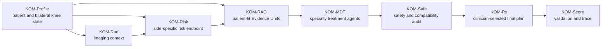

[README.md](https://github.com/user-attachments/files/28965372/README.md)
# KOM - Knee Osteoarthritis Manager

[Open the public demo](https://kom-workbench-public-demo.onrender.com/dashboard)

KOM is a clinician-facing research workbench for knee osteoarthritis management. It was built to show, in one place, how a patient with knee osteoarthritis can move from structured assessment to imaging context, longitudinal risk estimation, evidence retrieval, multidisciplinary treatment planning, safety review, and a final clinician-controlled prescription report.

This project is meant for people who want to inspect the workflow, reuse the code, study the skill system, test the public web version, or understand how a knee osteoarthritis decision-support pipeline can be made traceable from input to output. It is not a patient self-diagnosis tool, not an autonomous prescribing system, and not a replacement for licensed clinical judgment.

## Quick Orientation

KOM has three practical surfaces:

| Surface | Who it is for | What it contains |
|---|---|---|
| Public web demo | Reviewers, collaborators, clinicians, and readers who want to see the workflow without installing anything | A hosted browser version of the KOM workbench with de-identified showcase cases and interactive modules. |
| Code package | Developers and research collaborators who want to inspect, run, adapt, or audit the system | Python backend, browser frontend, Evidence Unit data, graph files, validation scripts, deployment files, and reproducibility scripts. |
| KOM Skills | Users who want the reusable reasoning layer behind the workflow | Skill modules for patient intake, imaging-risk reasoning, treatment-agent routing, Evidence Unit GraphRAG, literature learning, case demonstration, and controlled updates. |

The web page is only the visible entry point. The project also includes a backend API, structured evidence data, a graph-based retrieval layer, treatment-agent logic, safety negotiation, validation checks, and a reusable skill pack.

## Current Demo

The public demo is available here:

```text
https://kom-workbench-public-demo.onrender.com/dashboard
```

The hosted workbench serves the dashboard page and exposes a validation endpoint at:

```text
https://kom-workbench-public-demo.onrender.com/api/v9/validate
```

For this release, the validation endpoint reports `KOM_ENGLISH_READY` with `40/40 checks passed`. If the Render service has been idle, the first visit may take a short moment while the service wakes.

## What KOM Is Trying To Solve

Knee osteoarthritis care is rarely decided by one number. A clinician usually has to connect symptoms, functional limitation, imaging findings, body weight, metabolic burden, previous treatment, medication risks, injection boundaries, exercise tolerance, surgical referral thresholds, patient goals, and the strength of supporting evidence.

KOM turns that scattered decision process into a reproducible pathway:

- build a structured profile for the patient and both knees;
- keep left and right knee information separate where it matters;
- attach imaging context without letting imaging alone make the decision;
- estimate longitudinal risk in a way that remains visible to the user;
- retrieve evidence as traceable Evidence Units rather than loose text;
- route the case to specialty treatment agents;
- check safety gates before a draft plan becomes a final plan;
- let the clinician choose the final treatment modules;
- export a report and validation trace that another reader can inspect.

The goal is not to make the system sound mysterious. The goal is the opposite: each step should be visible enough that a clinician, reviewer, collaborator, or developer can see what the system used, what it did, and where human review remains necessary.

## What You Can Do In The Workbench

| Module | What it does |
|---|---|
| Dashboard | Shows the full KOM-Assess and KOM-Treat pathway and links directly to the major layers. |
| KOM-Profile | Loads compact patient examples, edits bilateral KL grade, pain NRS, WOMAC function, BMI and safety fields, and saves the profile state for downstream modules. |
| KOM-Rad | Displays structured imaging context for the knees and keeps imaging interpretation separate from treatment selection. |
| KOM-Risk | Sends the current case state to the backend risk endpoint and returns side-specific risk estimates for structural progression, surgery events, and symptom/function worsening. |
| KOM-RAG | Searches the local Evidence Unit catalog, retrieves patient-fit evidence, displays an interactive evidence network, and opens detailed evidence cards. |
| KOM-MDT | Runs a specialty treatment board for rehabilitation, nutrition/weight, medication and injection, psychology/self-management, and orthopaedic referral boundaries. |
| KOM-Safe | Audits medication, injection, exercise, surgery, nutrition, psychology, missing-data, and compatibility gates before a plan is accepted. |
| KOM-Rx | Lets the clinician select final prescription modules and exports a structured clinical report with evidence support and safety notes. |
| KOM-Score | Runs validation checks and displays the process trace for review. |
| Settings | Allows optional OpenAI-compatible model configuration. The local deterministic pathway remains available without a private model key. |

## How The Workflow Fits Together



The design keeps module boundaries explicit. Patient intake does not write the final prescription. Imaging findings do not automatically trigger surgery. Evidence retrieval does not become a treatment order. Treatment agents produce drafts, and KOM-Safe plus clinician review decide what can move forward.

## Core Components

### KOM-Profile

KOM-Profile is the entry point for the clinical case. It stores demographics, BMI, pain, WOMAC function, KL grade, symptom burden, treatment history, safety fields, and missing information. The current workbench keeps left and right knees explicit across the workflow, because the two knees may have different KL grades, pain levels, functional burden, and treatment priorities.

### KOM-Rad

KOM-Rad provides imaging context. It records side-specific structural information and connects radiographic severity to the rest of the case without treating the image as a stand-alone decision-maker. KL grade is changed in KOM-Profile and then read by downstream modules.

### KOM-Risk

KOM-Risk estimates risk across three outcome domains:

- structural progression;
- fixed-window knee surgery events;
- symptom and function worsening.

The current workbench uses an endpoint-backed bilateral risk pathway. Modifiable scenario variables such as BMI, pain NRS, and WOMAC function can be adjusted, while observed KL grade remains locked from the profile. The risk output is meant to support follow-up intensity, patient communication, and evidence retrieval. It is not a final treatment decision by itself.

### KOM-KB and KOM-RAG

KOM-KB stores literature and guideline information as structured Evidence Units. An Evidence Unit can include the source, evidence level, treatment domain, population, intervention, comparator or context, outcomes, safety notes, prescription relevance, and traceability fields.

KOM-RAG retrieves evidence by using patient context, treatment domain, guideline anchors, evidence tiers, safety tags, and graph relationships. The current local catalog contains thousands of Evidence Units and supports patient-fit retrieval, catalog search, graph display, detailed evidence cards, pagination, and JSON export.

### KOM-MDT

KOM-MDT is the multidisciplinary treatment board. It routes the case to specialty agents for:

- exercise and rehabilitation;
- weight, nutrition, and metabolic risk;
- medication and injection options;
- psychology, behavior, and self-management;
- orthopaedic referral boundaries;
- final treatment synthesis.

Each agent should explain patient fit, evidence basis, prescription content, non-selection reasoning, safety limits, and review boundaries.

### KOM-Safe

KOM-Safe is the safety and compatibility layer. It checks whether a proposed plan has unresolved medication risks, injection conflicts, exercise overload, fall-risk concerns, missing safety fields, surgical boundary issues, or cross-specialty contradictions.

When a gate is not passed, KOM-Safe can send the issue back to the responsible specialty agent, record the revision, re-audit the output, and preserve an event-level trace.

### KOM-Rx

KOM-Rx is the final clinician-facing output layer. The clinician selects the modules that should appear in the final plan. The saved report carries treatment content, evidence support, safety gates, and clinician-review boundaries. This keeps the final prescription visible and editable rather than hidden inside a model response.

### KOM-Score and KOM-Sim

KOM-Score supports validation of the workbench, route availability, English public wording, interface controls, RAG views, MDT prescriptions, Safe-MDT negotiation, and report export. KOM-Sim supports clinician-in-the-loop simulation and human-computer interaction evaluation.

## KOM Skills

The KOM Skills package is the reusable workflow layer that sits behind the workbench. It is written for knee osteoarthritis work rather than for generic conversation. The skills define how patient information is captured, how imaging and risk are interpreted, how treatment agents are routed, how evidence is handled, how reviewer demonstrations are built, and how future changes should be governed.

| Skill | Role |
|---|---|
| `koa-integrated-care-orchestrator` | Coordinates the complete case flow from patient intake to treatment-plan assembly. |
| `koa-patient-intake-assessment` | Extracts patient information, identifies missingness and red flags, and normalizes the clinical profile. |
| `koa-imaging-risk-progression` | Handles imaging appropriateness, structural severity, symptom-imaging mismatch, risk stratification, and progression forecasting. |
| `koa-treatment-agent-system` | Routes the patient profile into treatment-domain agents and the evidence database. |
| `koa-case-demonstration-showcase` | Builds reviewer-facing case demonstrations with intake, imaging, Evidence Unit GraphRAG, MDT output, safety audit, final plan, and HCI evaluation. |
| `koa-literature-learning-research-suite` | Supports KOA literature learning, evidence matrices, systematic-review planning, citation audit, manuscript planning, and reviewer simulation. |
| `koa-self-evolution-governance` | Controls how new databases, guidelines, reviewer comments, user feedback, and code changes are accepted, rejected, or logged. |

For a reader using the skills directly, the main idea is simple: each skill has a narrow responsibility, and the system should not skip evidence, safety, or review steps just because a later module wants an answer quickly.

## Code Package

The code package is arranged so that readers can separate the live application from review code, reproducibility scripts, figures, and model-pipeline materials.

```text
KOM_Project_Code_Package_20260616_001908/
  README.md
  00_README_FOR_SUBMISSION.md
  00_CODE_INVENTORY.csv
  01_final_workbench_code/
    app/
      backend/
        server.py
        adapters/
        services/
        validation/
      static/
        index.html
        kom_v9.js
        kom_v9.css
        assets/
      data/
        evidence_units.jsonl
        graph_nodes.json
        graph_edges.json
        v9_workbench_content.json
        safety_rules.json
    tools/
    validation/
    Dockerfile
    render.yaml
    README_START_HERE.md
    README_GITHUB_AND_WEB_DEPLOY.md
  02_reviewer_demo_source/
    src/
    e2e/
    scripts/
    package.json
  03_reproducibility_scripts/
  04_figures_methods_generation/
  05_model_pipeline_protocols/
  06_review_ready_runtime_notes/
```

Important files:

| File or folder | Why it matters |
|---|---|
| `01_final_workbench_code/app/backend/server.py` | Main backend server, API routes, risk endpoint, evidence retrieval, agent chat, Safe-MDT negotiation, profile persistence, final Rx persistence, validation, and report export. |
| `01_final_workbench_code/app/static/kom_v9.js` | Main browser application and page logic for the workbench. |
| `01_final_workbench_code/app/static/kom_v9.css` | Clinician-facing interface styling. |
| `01_final_workbench_code/app/data/evidence_units.jsonl` | Local Evidence Unit catalog. |
| `01_final_workbench_code/app/data/graph_nodes.json` and `graph_edges.json` | Evidence graph data used by the RAG network display. |
| `01_final_workbench_code/app/data/v9_workbench_content.json` | Core module content, case content, and workbench definitions. |
| `01_final_workbench_code/tools/` | Evidence enrichment and supporting data utilities. |
| `01_final_workbench_code/validation/` | Validation reports and package integrity outputs. |
| `Dockerfile` and `render.yaml` | Files for public web deployment. |
| `02_reviewer_demo_source/` | Reviewer-facing React/Vite source, tests, and build scripts. |
| `03_reproducibility_scripts/` | Scripts for audit, evaluation, package building, and result completion. |
| `04_figures_methods_generation/` | Figure, table, audit, and supplementary-method generation assets. |
| `05_model_pipeline_protocols/` | Model and training-protocol materials used to document the risk pipeline. |

## Backend API

The backend is intentionally visible. The most important routes are:

| Route | Purpose |
|---|---|
| `/dashboard` | Main browser entry point. |
| `/api/v9/content` | Loads the workbench content and current release metadata. |
| `/api/v10/profile/generate` | Generates a structured KOM-Profile output from the current patient state. |
| `/api/v9/rad/analyze` | Runs the radiology workflow state transition. |
| `/api/v9/risk/predict` | Returns side-specific and bilateral-coupled risk estimates. |
| `/api/v10/evidence/units` | Searches or exports Evidence Units. |
| `/api/v10/evidence/patient-fit` | Retrieves patient-fit evidence for the selected case and treatment domain. |
| `/api/v9/agent/chat` | Returns specialty-agent responses through local or optional model-assisted pathways. |
| `/api/v15/safe/negotiate` | Runs Safe-MDT negotiation and revision tracing. |
| `/api/v16/profile/save` | Saves the current patient profile configuration. |
| `/api/v16/rx/finalize` | Saves the clinician-confirmed final KOM-Rx. |
| `/api/report` | Exports the report as Markdown or HTML. |
| `/api/v9/validate` | Runs workbench validation checks. |

## Running The Local Package

For the full Windows local package:

1. Extract the complete folder.
2. Double-click `Start_KOM_Workbench_Portable.bat`.
3. Open `http://127.0.0.1:8027/dashboard`.
4. If port `8027` is busy, the portable launcher can try `8067`.
5. Use `Stop_KOM_Workbench.bat` when finished.

Validation:

```bat
Run_Validation.bat
```

Package integrity:

```bat
runtime\python\python.exe package_integrity.py
```

The public web deployment uses the platform `PORT` variable. For public deployments, set:

```text
KOM_PUBLIC_DEMO=1
```

In public-demo mode, private API keys should not be persisted through the browser settings page. For controlled private deployments, use server-side environment variables.

## Evidence, Data, And Reproducibility

KOM uses de-identified demonstration cases and derived research artifacts. Raw restricted clinical datasets are not redistributed unless sharing is explicitly permitted.

The project is designed to provide enough material for inspection even when raw data cannot be shared:

- application code and workflow scripts;
- Evidence Unit schema and derived catalogs;
- graph nodes and graph edges;
- feature and model documentation;
- source-data tables for figures;
- audit and validation reports;
- package integrity checks;
- reviewer-facing demonstration cases;
- reproducibility notes.

The evidence layer is designed for traceability. A treatment statement should be connected to a domain, an evidence level, a source or Evidence Unit, and a safety or applicability boundary whenever possible.

## What This Project Is Good For

KOM can be useful for:

- reviewing a full knee osteoarthritis decision-support workflow;
- demonstrating clinician-in-the-loop medical AI design;
- testing evidence retrieval and Evidence Unit GraphRAG;
- studying specialty-agent treatment planning;
- auditing safety-gated clinical recommendation workflows;
- preparing research demonstrations, manuscripts, supplements, or reviewer materials;
- adapting the code and skills to related chronic disease decision-support tasks.

It is especially useful when the reader wants to see more than a final answer. KOM shows the intermediate state: patient profile, imaging context, risk estimate, evidence retrieval, specialty reasoning, safety negotiation, final prescription, and validation trace.

## Clinical And Research Boundary

KOM is a research prototype for clinician-facing decision-support validation. It should not be used for:

- direct patient self-diagnosis;
- autonomous treatment recommendation;
- unsupervised medication or injection prescription;
- automatic surgical decision-making;
- clinical deployment without prospective validation, governance review, and local regulatory approval.

Medication, injection, surgery, exercise, nutrition, and psychology recommendations require clinician review. The system is designed to support that review, not replace it.

## Contact

For questions, bug reports, feedback, research collaboration, deployment issues, or suggestions about the web demo, code package, or KOM Skills, please contact:

```text
weizhi_L_sportsmed@163.com
```

Maintainer: Weizhi L.  
Research interests: sports medicine, knee osteoarthritis, digital health, clinical AI, chronic disease management.
